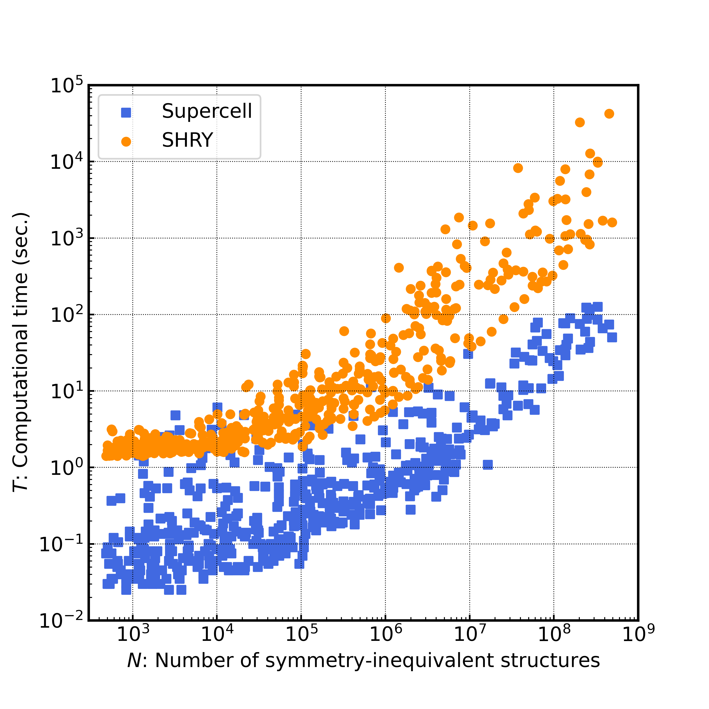

# 03 Scailing benchmark
You can benchmark the computational times of 500 CIF files taken from the Crystallography Open Database (COD) database [http://www.crystallography.net/cod/].

## Compound list
Check the structures used in the benchmark test:

``benchmark_SG_all.xls``

## Benchmark tests

In the benchmark test, you can measure conputational times and memory consumptions. First, you should edit ``bench.py``.

```pyhthon:bench.py
TIME_LOOP=2 # how many time you are going to measure

BABEL=False # True for supercell ver.1.2, False for that >= ver.2.0
SUPERCELL_PATH="your path to supercell BINARY"
SHRY_PATH = "your path to shry DIRECTORY"

SUPERCELL_FLAG=True # if false, supercell jobs are skipped.
SHRY_FLAG=False # if false, shry jobs are skipped.
```

Before the benchmark test, you should establish your python enviroment in which all the depenedent python packages are installed.

```bash:
conda activate shry
```

## Sequential benchmark test

If you want to run the benchmark test sequentially:

```bash:
python bench.py benchmark_SG_all.xls SG_all > out_bench_SG_all # run test
```

## Simultaneous benchmark test

If you want to run the benchmark test for each SG, you can split the xsl file:

```bash:
python bench_split_xsl.py # split the xsl files, benchmark_SG_XXX.xls.
```

You can run the benchmark test independently

```bash:
sg=1; python bench.py benchmark_SG_${sg}.xls SG${sg} > out_bench_SG${sg} # run test
```

The output of ``bench.py`` is written in ``out_bench_SG${sg}``. The outputs of shry and supercell are stored in ``stdout`` and ``stderr`` directories. The measured time/memory/etc.. are summarized in ``out_benchmark_SG_${sg}.xls``

If run the benchmark for each SG simultaneously on a cluster machine, you see an example of a job-submission script:

```bash:
./bench_run.sh  # submit jobs
```

You can combine the xsl files after you run the benchmark test independently.

```bash:
python bench_combine_xsl.py  
```

## Benchmark result
The benchmark result is summerized in ``benchmark_result.csv``. 
You can also plot the graphs in our paper by the jupyter notebook ``benchmark_plots.ipynb``.

 
